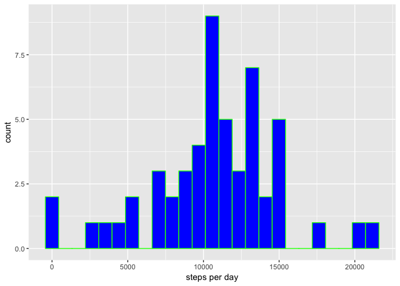
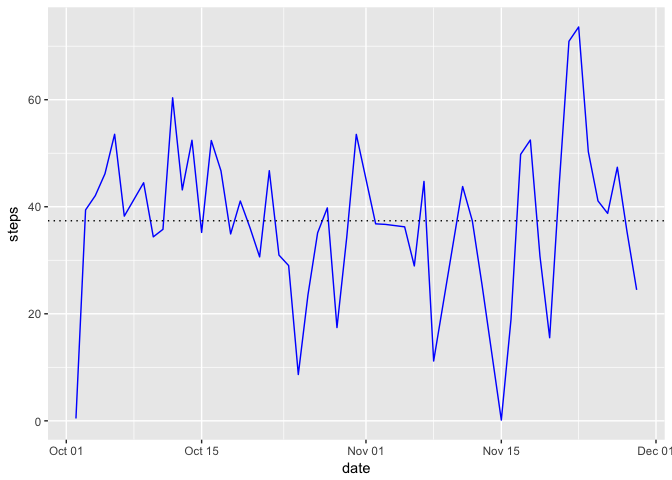
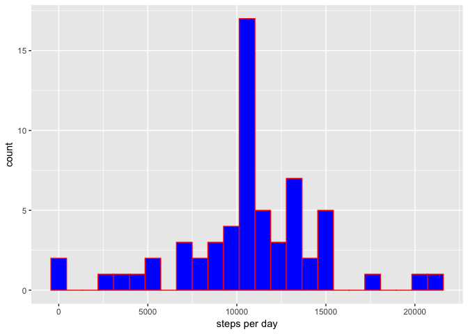
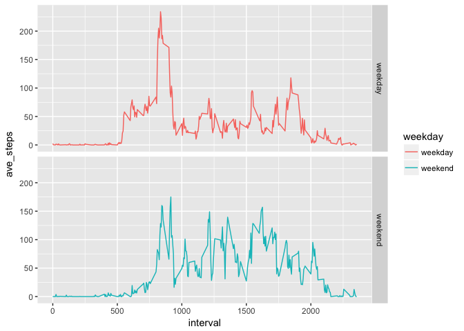

## Overview

This report outlines metrics gathered from two months of activity data gathered from 
an anonymous individual collected during the months of October and November, 2012.

## Setup


## Loading and preprocessing the data


```r
library(ggplot2)
all_activities <- read.csv(unzip("activity.zip", "activity.csv"))
file.remove("activity.csv")
```

```
## [1] TRUE
```

```r
activity <- all_activities[!is.na(all_activities$steps),]
activity$date <- as.Date(activity$date, "%Y-%m-%d")
summary(activity)
```

```
##      steps             date               interval     
##  Min.   :  0.00   Min.   :2012-10-02   Min.   :   0.0  
##  1st Qu.:  0.00   1st Qu.:2012-10-16   1st Qu.: 588.8  
##  Median :  0.00   Median :2012-10-29   Median :1177.5  
##  Mean   : 37.38   Mean   :2012-10-30   Mean   :1177.5  
##  3rd Qu.: 12.00   3rd Qu.:2012-11-16   3rd Qu.:1766.2  
##  Max.   :806.00   Max.   :2012-11-29   Max.   :2355.0
```

## What is mean total number of steps taken per day?


```r
mean(activity$steps, na.rm = TRUE )
```

```
## [1] 37.3826
```


```r
# summarize the steps by day
steps_per_day <- aggregate(list(steps = activity$steps), list(date = activity$date), FUN=sum)
gs <- ggplot(steps_per_day)
gs + geom_histogram(aes(x = steps), fill = "blue", color="green", bins =25) + labs(x = "steps per day")
```

<!-- -->

```r
summary(steps_per_day$steps)
```

```
##    Min. 1st Qu.  Median    Mean 3rd Qu.    Max. 
##      41    8841   10765   10766   13294   21194
```

## What is the average daily activity pattern?


```r
average_steps_per_day <- aggregate(list(steps = activity$steps), list(date = activity$date), FUN=mean)
ga <- ggplot(data = average_steps_per_day)
ga + geom_line(aes(x = date, y = steps), color = "blue") + 
  geom_hline(yintercept = mean(average_steps_per_day$steps), linetype = "dotted")
```

<!-- -->

```r
activity[activity$steps == max(activity$steps, na.rm = TRUE), ]
```

```
##       steps       date interval
## 16492   806 2012-11-27      615
```

## Imputing missing values


```r
nrow(all_activities[is.na(all_activities$steps),])
```

```
## [1] 2304
```

```r
# replace all NA's with the mean of steps and store it in a new data frame
no_nas <- all_activities
no_nas[is.na(no_nas)] <- mean(no_nas$steps, na.rm = TRUE)
head(no_nas)
```

```
##     steps       date interval
## 1 37.3826 2012-10-01        0
## 2 37.3826 2012-10-01        5
## 3 37.3826 2012-10-01       10
## 4 37.3826 2012-10-01       15
## 5 37.3826 2012-10-01       20
## 6 37.3826 2012-10-01       25
```

```r
# re-compute the sum of steps per day
no_nas_per_day <- aggregate(list(steps = no_nas$steps), list(date = no_nas$date), FUN=sum)
gn <- ggplot(data = no_nas_per_day)
gn + geom_histogram(aes(x = steps), fill = "blue", color="red", bins =25) + labs(x = "steps per day")
```

<!-- -->

### Summary with missing values replaced with mean

```r
summary(no_nas_per_day$steps)
```

```
##    Min. 1st Qu.  Median    Mean 3rd Qu.    Max. 
##      41    9819   10766   10766   12811   21194
```

### Original Summary values

```r
summary(steps_per_day$steps)
```

```
##    Min. 1st Qu.  Median    Mean 3rd Qu.    Max. 
##      41    8841   10765   10766   13294   21194
```
```


## Are there differences in activity patterns between weekdays and weekends?


```r
activity$weekday <- as.character(lapply(strftime(activity$date, format = "%w"), 
                           FUN = function(x) { if (x >= 1 && x <= 5) c("weekday") else c("weekend")}))
average_steps_per_interval <- aggregate(list(ave_steps = activity$steps), list(interval = activity$interval, weekday = activity$weekday), FUN=mean)

summary(average_steps_per_interval)
```

```
##     interval        weekday            ave_steps      
##  Min.   :   0.0   Length:576         Min.   :  0.000  
##  1st Qu.: 588.8   Class :character   1st Qu.:  1.854  
##  Median :1177.5   Mode  :character   Median : 26.295  
##  Mean   :1177.5                      Mean   : 39.208  
##  3rd Qu.:1766.2                      3rd Qu.: 62.321  
##  Max.   :2355.0                      Max.   :234.103
```

```r
table(average_steps_per_interval$weekday)
```

```
## 
## weekday weekend 
##     288     288
```

```r
gw <- ggplot(data = average_steps_per_interval, aes(x = interval, y = ave_steps, color=weekday))
gw + geom_line() + facet_grid(weekday ~ .)
```

<!-- -->
